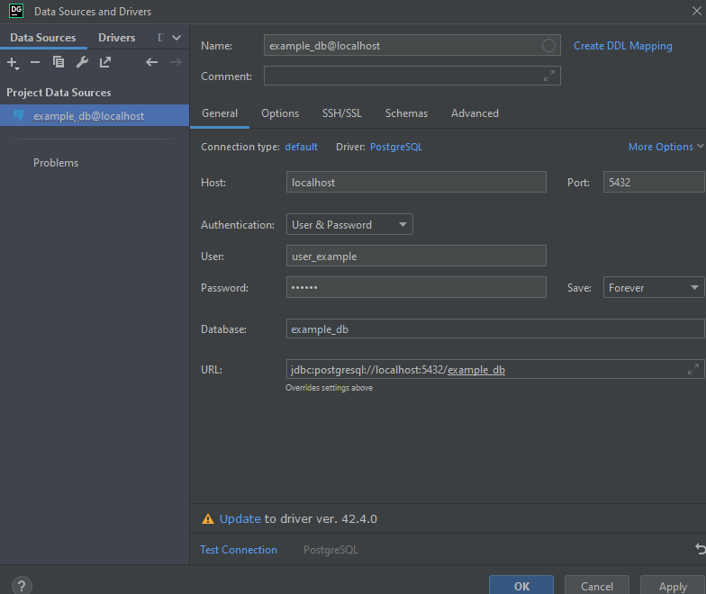

# Установка всех пакетов 
- пакеты для прохождения курса бакалавриата ИУ5 МГТУ им. Баумана на Linux

## общее

### **node js**
```bash
sudo curl -sL https://deb.nodesource.com/setup_14.x -o nodesource_setup.sh
sudo bash nodesource_setup.sh     # этот скрипт обновит данные о том, откуда можно скачать последнюю версию node
sudo rm nodesource_setup.sh       # удалите установочный скрипт
sudo apt-get install nodejs npm   
sudo npm install -g npm@latest
node -v                           # если все сделано правильно, версия node будет 14.16.0+
```

<br/><br/>

---

### **python**

```bash
sudo apt-get install python3
```

Стандартная установка и запуск проекта
```bash
# Если что-то не ставится, проверить версию python. По умолчанию в убунту python может быть алиасом над python2.7

python -m venv venv
python -m pip install -r requirements
python ./WorkerScript/main.py  # запуск из корня проекта!
```
Для различных домашек может понадобится построение графиков. Работать можно в jupiter (.ipynb)
- python3
- [requirements](./requirements-matplotlib.txt)

<br/><br/>

---
### **go**

- установка по [гайду](https://go.dev/doc/install)
- не забыть записать в PATH
- в Windows это делается через панель управления с последующей перезагрузкой. Если переменная PATH слишком длинная, там же можно применить алиасы для путей до бинарника.

<br/><br/>

---
### **postgres**

JetBrains DataGrid / pgAdmin

```bash
psql -U postgres
```
```sql
-- создание базы
CREATE USER user_example WITH password '123456';
CREATE DATABASE example_db OWNER user_example;
-- Возможно, потребуется выдать привелегии:
GRANT ALL PRIVILEGES ON DATABASE example_db TO <yourname>;
```
Подключение к БД через датагрип



<br/><br/>


## 1 курс 1 семестр
- В MS VS не требуется
- В ручной сборке:
  - установка

    ```bash
    sudo apt-get update --yes

    sudo apt-get install cmake
    sudo apt-get install valgrind
    sudo apt-get install libgtest-dev
    sudo apt-get install lcov

    # установка gtest. Аналогично для gmock
    sudo cd /usr/src/gtest
    sudo cmake CMakeLists.txt
    sudo make
    sudo cp lib/*.a /usr/lib
    cd -
    ```
  
  - сборка
    - [базовый симейк для большинства проектов с тестированием](./CMakeList.txt)
    - ```
      mkdir cmake-build
      cd cmake-build
      cmake ..
      make all
      ```

  - тестирование
    ```bash
    # unit-тесты
    ./cmake-build/vector_test
    # утечки памяти
    valgrind --tool=memcheck --leak-check=summary ./vector_test
    ```
  
  - замер процента покрытия тестами
    ```bash
    lcov -t "testing" -o coverage.info -c -d src/CMakeFiles
	  lcov --remove coverage.info -o coverage.info '/usr/include/*' '/usr/lib/*'
	  genhtml -o report coverage.info
    ```
<br/><br/>

## 1 курс 2 семестр
###

<br/><br/>

## 2 курс 3 семестр
### пакеты для курса Электротехника Белодедова
- Electronics WorkBench (Windows)
- Excel (Windows)
### пакеты для курса МД Ревункова
- MS Access (Windows)
### пакеты для курса БКИТ Ю. Е. Гапанюка
- ?

<br/><br/>

## 2 курс 4 семестр
### пакеты для курса Электроника Белодедова
- Proteus (Windows)
- Excel (Windows)

### пакеты для курса Схемотехника Спиридонова
- Electronics WorkBench (Windows)

Остально не не знаю. Семестр переработали: ассемблер, БД, js

<br/><br/>


## 3 курс 5 семестр
### пакеты для курса СТ Галкина
 - cisco packet tracer (Windows)

### пакеты для курса РИП Ю. Е. Гапанюка
- node
- Django

### пакеты для курса ТАУ Лукьянова
- matlab (Мы делали на Windows)

<br/><br/>

## 3 курс 6 семестр

### пакеты для курса СТ в АСОИУ А. И. Антонова
 - cisco packet tracer (Windows)

### пакеты для курса ТМО Ю.Е.Гапанюка
- node
- python3
- [requirements](./requirements-ТМО-Гапанюк.txt)
- 870 Мб

### пакеты для ДЗ ТММ
- python3
- [requirements](./requirements-ТММ-Афанасьев-OpenCV-mediapipe.txt)
- тут есть готовые НС mediapipe, они нужны не всем
- размер точно не известен. Полагаю, около 1 Гб

<br/><br/>

## 4 курс 7 семестр
### МППР
- python3
- [requirements](./requirements-МППР-pytorch.txt)
- 1,15 ГБ

<br/><br/>

## 4 курс 8 семестр
- ?
